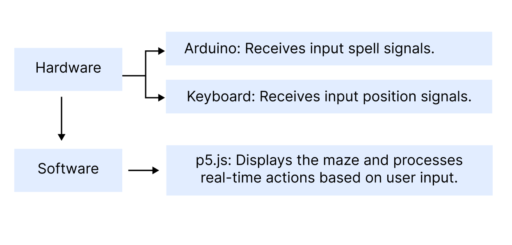
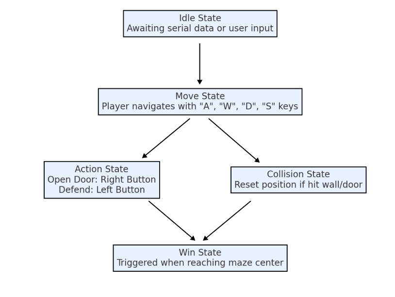
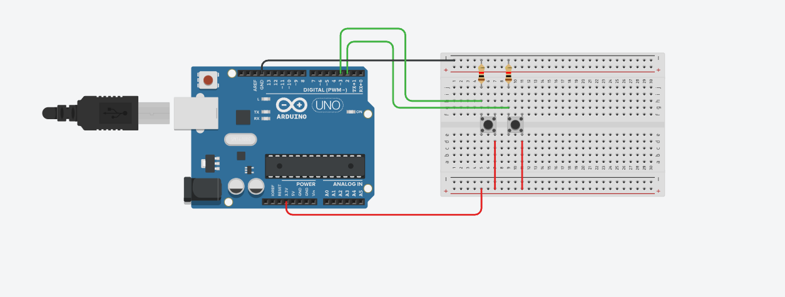
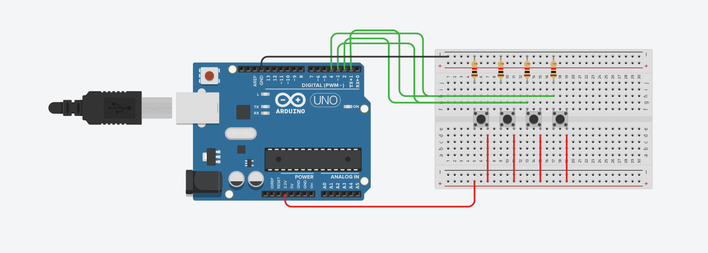

# Milstone 4:
## Harry Potter Themed Interactive Hexagonal Maze
#### Project Overview
This project brings a plot of Harry Potter to life through an interactive maze game. Players must navigate a hexagonal maze to reach the goal while overcoming obstacles like Dementors. The game integrates p5.js for visualization and Arduino for real-world controls using a potentiometer for movement and a button for actions like opening doors (“Alohomora”) or defending against Dementors (“Expecto Patronum”).
#### System diagram
Arduino: Receives input spell signals.
Keyboard: Receives input position signals.
Software (p5.js): Displays the maze and processes real-time actions based on user input.
Control: keyboard “w”,”a”,”r”,”d” for position and button for opening doors/casting spells.

#### FTM diagram

Idle State: Awaiting serial data or user input.
Move State: Player navigates through "A", "W", "D", "S" keys
Action State:
Open Door: User presses right button ("Alohomora").
Defend: User presses left button("Expecto Patronum").
Collision State: Reset player position if they hit a wall/door without opening it.
Win State: Triggered when the player reaches the maze’s center.
#### Circuit diagram

#### Sensors:
Keyboard: Controls player movement direction.
Button: Performs interactions (e.g., opening doors).
#### Output Components:
Computer Screen: Displays the interactive maze with real-time feedback.
#### How It Relates to Our Readings
This project embodies the ideas discussed in Program or Be Programmed, where programming is not just a technical skill but a tool for storytelling and creating immersive experiences. By integrating physical components like Arduino with programming, the game enhances sensory engagement and interactivity.Programming becomes a medium for expressing emotions and ideas—transforming code into a magical world where players experience fantasy and wonder, just like storytelling through programming.
#### How It Relates to Society
In a society increasingly focused on virtual experiences , interactive systems offer ways for people to escape reality, explore themselves, and connect emotionally.
This maze game aligns with the growing need for immersive virtual spaces, where players can find moments of magic and joy. 
#### Why This Is Important to Me
This project represents a childhood dream come to life.（I eagerly awaited my Hogwarts letter as a child）. Fantasy worlds such as Harry Potter or Ready Player One's Oasis provide an escape from life’s hardships and a chance to experience wonder.
By building this game, I hope to create a small piece of utopia—a magical world where players can feel the excitement of spells, adventure, and exploration.
#### User Testing Feedback
Through testing, users found the game interesting but felt it was a bit too difficult because the player is reset to the starting position every time they touch a line or a dementor.
#### Suggestions:
Add sound effects for actions like “Alohomora” and “Expecto Patronum.”
Provide visual feedback when interacting with the environment.
#### How to Run the Project
Upload the Arduino Code:
Connect your Arduino board to the computer.
Upload the arduino.ino file using the Arduino IDE.
Set Up the p5.js Environment:
Open the sketch.js file in a p5.js-compatible editor (e.g., p5.js Web Editor or local setup).
Connect the Arduino:
Ensure the serial port is accessible.
Click Connect to Serial in the p5.js game window.
Start the Game:
Use the potentiometer for direction control and the button for actions.
Alternatively, navigate using "A", "W", "D", "S" keys and press right button to open doors, press left button to delete the dementor.
#### Future Improvements
Add sound effects for magical spells.
Improve maze complexity by generating dynamic hexagonal patterns.
Optimize serial communication for faster input responsiveness.
Integrate haptic feedback using motors for enhanced interaction.

# Milstone 3：
This week,I updated the circuit diagram and completed the basic maze setup. Additionally, I wrote the Arduino code for data transmission. Next week, I plan to refine the visuals, integrate p5.js with Arduino, and improve certain interactions (such as making the user return to the center of the current room instead of the maze's starting point when touching a wall). If time permits, I will also add wandering Dementors.

# Milestone 2: Harry Potter Maze Game
This project is an interactive maze game based on the Harry Potter theme. Players must navigate a maze made of hexagonal rooms to reach the center. Along the way, they will encounter obstacles like Dementors. Arduino is used to receive control signals from the user, such as a potentiometer to control direction and a button to open doors ("Alohomora") or defend against Dementors ("Expecto Patronum"). P5.js is responsible for displaying the maze and providing real-time feedback.

For this week, I create a basic cell of this maze with the help of chatGPT in refining code and debugging (like how to use draw() inside class).Now it allows user to move through "A","W","D","S", and can open the green door by press"O". And if user touch the door or wall without opening it,they would be reset to initial position.And the code I write as well as fake code are all stored in sketch.js.

##### Circuit Diagram

##### Data Collection and Transmission:
The potentiometer reads an analog angle value (0-1023) and maps it to a 360-degree direction.
The button receives a digital signal, which is used to detect press, release, or long press.
Arduino sends this data to the computer via serial communication.
##### Data Processing:
In p5.js, serial data is parsed to update the player's position or perform actions (like opening doors or casting spells).
Visualize direction, highlight target doors, or display dynamic effects.
Materials and Mechanisms
##### Sensors:
Potentiometer: Controls direction by reading angle values.
Button: Provides basic interaction, such as opening doors or casting spells.
RGB LED: Indicates actions like successful spellcasting.
Computer Screen: Displays the maze and game progress.

##### How It Relates to Our Reading 
This project connects with reading in the way it enhances the meaning and sensory experience of the program by integrating Arduino's physical components.Program or Be Programmed tells an idea about programming is a tool for storytelling is explored. By combining programming with physical components like Arduino, I aim to increase the interactivity and sensory engagement of the project, making programming not just a technical tool, but a medium for creating a magical world. As a "programing" person, I hope to use programming to build a fantasy world that I love, just as the book suggests: programming can become a language for expressing ideas and emotions.

##### How It Relates to Society 
Programming is a vital part of technological development in society and impacts various industries. Through programming, I can create more interactive and immersive experiences, offering people a virtual space to escape from reality, explore themselves, and connect emotionally. In modern society, especially in the fields of video games and virtual reality, people increasingly seek ways to escape reality. Through this project, I aim to provide a meaningful virtual world for them, where they can explore and experience a utopia.

##### Why This Is Important to Me 
For me, this project also represents a childhood dream. Before I turned eleven, I truly and eagerly awaited the owl delivering my Hogwarts acceptance letter (lol). I believe that fantasy is an essential part of life, providing a break from the monotony and hardships of daily life. By creating such a fantasy world, I hope to offer a piece of utopia, like the Oasis in Ready Player One, where everyone can find their own place and experience magic.

User Testing Plan:

Invite classmates and friends to test the game.
Observe players' feedback on direction control, door opening, and spellcasting.
Collect suggestions and adjust the experience details accordingly.
##### Reference Images

# FinalProjection
 
## Harry Potter Spells
In this project, users use the gesture recognition model from ml5.js in p5.js, which detects the user's gestures through the camera (hidden from view). When the user performs a specific gesture, it triggers the animation of a magical spell (such as light beams, door opening, or floating feathers) and provides a light cue with LED lights controlled by Arduino. The LED lights follow a specific pattern to guide the user in pressing the correct sequence of buttons. If the user presses the buttons in the correct order, the corresponding magic effects (light beams, door opening, floating feathers) will be displayed on the screen, creating an immersive magical experience.

## Mood Lighthouse
In this project, users input their mood by pressing different buttons. The corresponding color of the LED light will light up (e.g., green for relaxation, red for tension), and at the same time, p5.js will play different music and display corresponding visualizations. This project helps users identify and express their emotions through sensory interactions (light, music, and visual effects), creating an atmosphere driven by emotional feedback.

## Star Map
In this project, users explore different constellations and their audio stories by pressing various buttons. Each button corresponds to a different constellation. When the user presses a button, the relevant constellation is highlighted on the screen, and a background audio story related to that constellation is played. Arduino reads the button inputs to control constellation selection, while p5.js is responsible for dynamically displaying the star map and visualizing the constellations. The external audio library plays the stories, providing an interactive visual and auditory experience.# FinalProjection
 