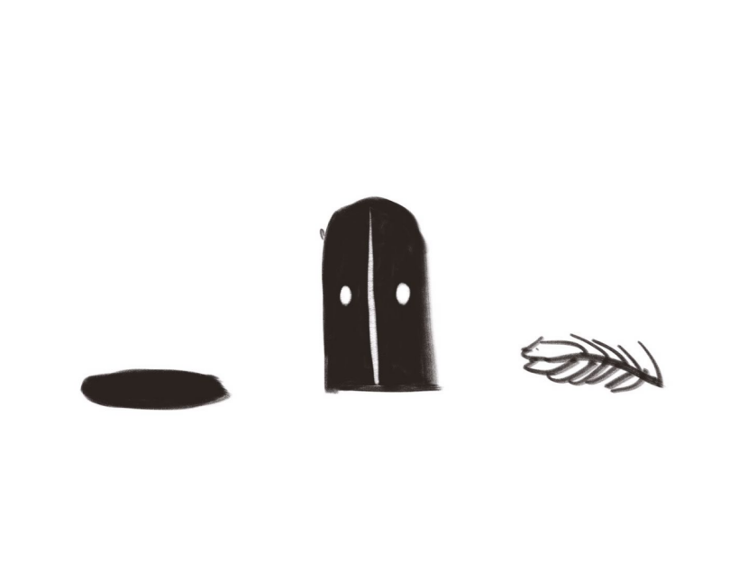

# FinalProjection
 
## Harry Potter Spells
In this project, users use the gesture recognition model from ml5.js in p5.js, which detects the user's gestures through the camera (hidden from view). When the user performs a specific gesture, it triggers the animation of a magical spell (such as light beams, door opening, or floating feathers) and provides a light cue with LED lights controlled by Arduino. The LED lights follow a specific pattern to guide the user in pressing the correct sequence of buttons. If the user presses the buttons in the correct order, the corresponding magic effects (light beams, door opening, floating feathers) will be displayed on the screen, creating an immersive magical experience.

## Mood Lighthouse
In this project, users input their mood by pressing different buttons. The corresponding color of the LED light will light up (e.g., green for relaxation, red for tension), and at the same time, p5.js will play different music and display corresponding visualizations. This project helps users identify and express their emotions through sensory interactions (light, music, and visual effects), creating an atmosphere driven by emotional feedback.

## Star Map
In this project, users explore different constellations and their audio stories by pressing various buttons. Each button corresponds to a different constellation. When the user presses a button, the relevant constellation is highlighted on the screen, and a background audio story related to that constellation is played. Arduino reads the button inputs to control constellation selection, while p5.js is responsible for dynamically displaying the star map and visualizing the constellations. The external audio library plays the stories, providing an interactive visual and auditory experience.# FinalProjection
 
